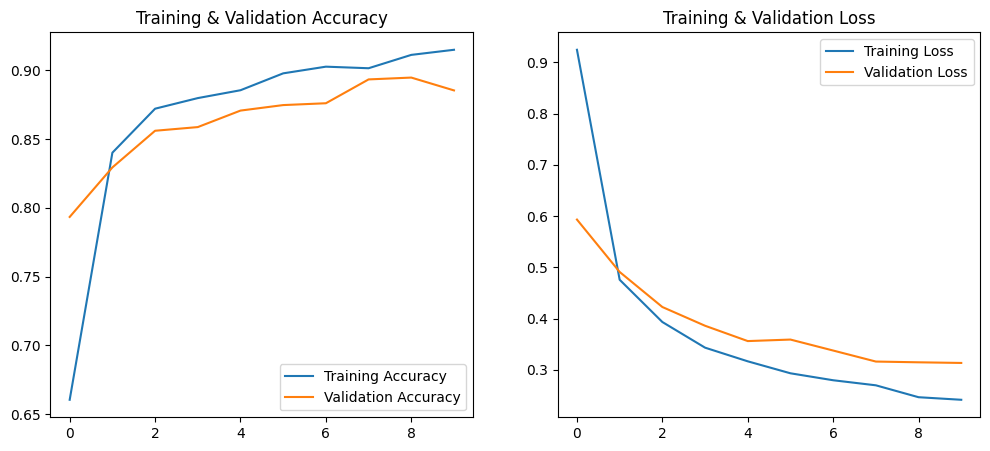
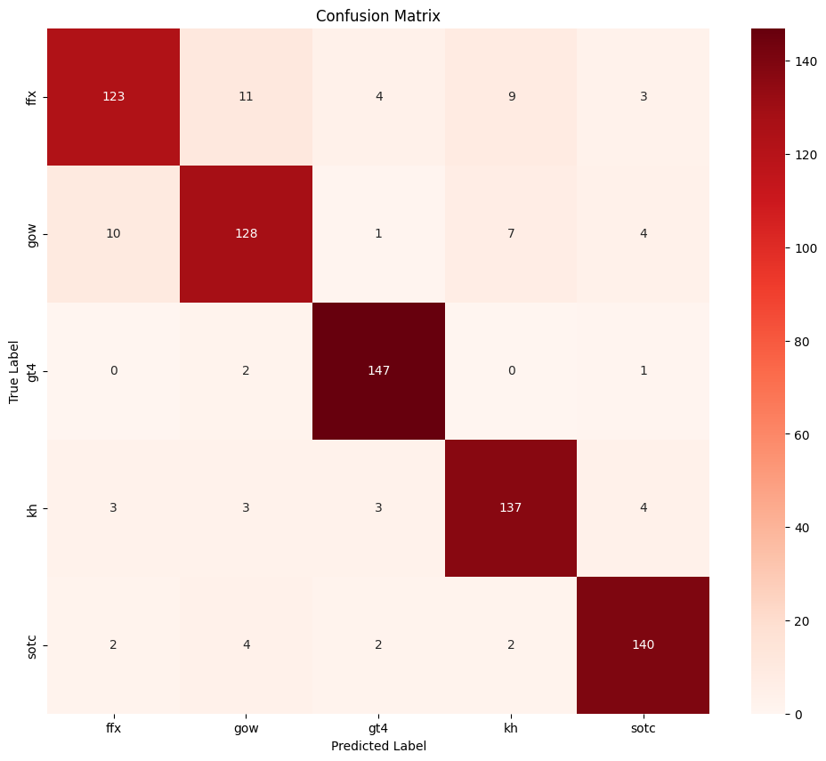

**Demonstration results**

Please note that the following graphics and performances refer to the demonstration model built with the original 5000-images sized dataset.

Over the course of 10 training epochs, the training and validation accuracy and loss evolved as follows:

Training accuracy and validation show an increasing trend, while the loss decreases. Overall, this indicates that the model is learning from the data, although the curves start to stabilize after epoch 6.Reducing the number of epochs slightly might improve performance by mitigating overfitting.

When evaluating the model on the test set, the resulting classification report is:

<pre>
              precision    recall  f1-score   support

         ffx       0.89      0.82      0.85       150
         gow       0.86      0.85      0.86       150
         gt4       0.94      0.98      0.96       150
          kh       0.88      0.91      0.90       150
        sotc       0.92      0.93      0.93       150

    accuracy                           0.90       750
   macro avg       0.90      0.90      0.90       750
weighted avg       0.90      0.90      0.90       750
</pre>

The results are overall satisfying, with both a complessive accuracy and average F1-score of 90%. In particular:
- Gran Turismo 4 seems to be the game yielding the best performance. This can be expected, as it's the only driving simulator game in the dataset and therefore contains very specific imagery that's not found in other types of games.
- Shadow of the Colossus is the second best performing game. Similar to Gran Turismo 4, Shadow of the Colossus presents a very unique approach to the video games scenery, with a lot of sceneries, nature and places to explore, but with the almost complete lack of enemies and characters. In the game, there are only 16 enemies, which are the 16 colossi that the protagonist Wander has to defeat in order to continue with the story, and there are no characters in the explorable landscapes.
- Final Fantasy X seems to be the worst performing game, yielding the lowest recall score at 82%. It's possible that some of the true instances of the class are lost to similar-looking imagery or games. It's possible that it was easily confused with Kingdom Hearts, since they both are developed by Square, with Kingdom Hearts even presenting characters from the Final Fantasy world.

In order to investigate further on the results, a confusion matrix was extracted:

As expected, the model classified a Final Fantasy X screenshot with Kingdom Hearts 9 times. Surprisingly, though, Final Fantasy X was wrongly interpreted as God of War 11 times. This isn't the only time the confusion between Final Fantasy X and God of War happens, since the model mistakenly classified a God of War screenshot as Final Fantasy X for the total of 10 times.

This confusion seems a bit odd, since the two games are graphically and thematically different, and they even belong to different genres (JRPG for Final Fantasy X, Hack and slash for God of War). The games, though, are two of the most clear examples of the PS2 hardware performance, as they both present detailed 3D models, cinematic cutscenes and visually-pleasing graphic effects. It's possible that this level of detail and graphic design is the reason between the model confusion.

All of the other mistakes are low on the scale, therefore we can consider our results satisfying.
